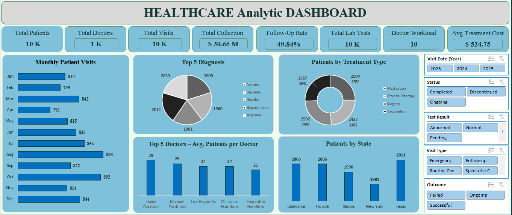
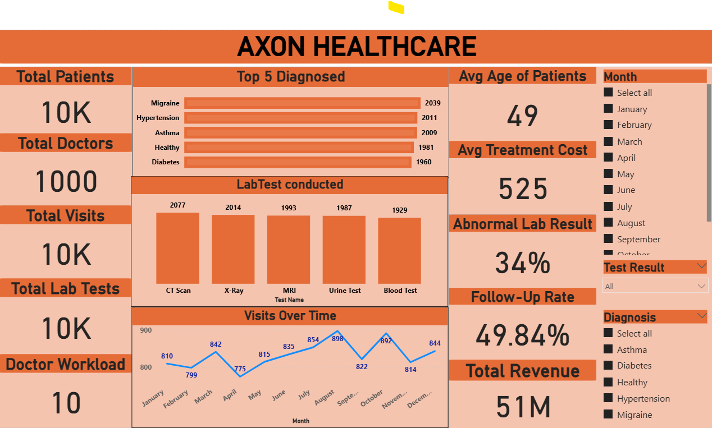
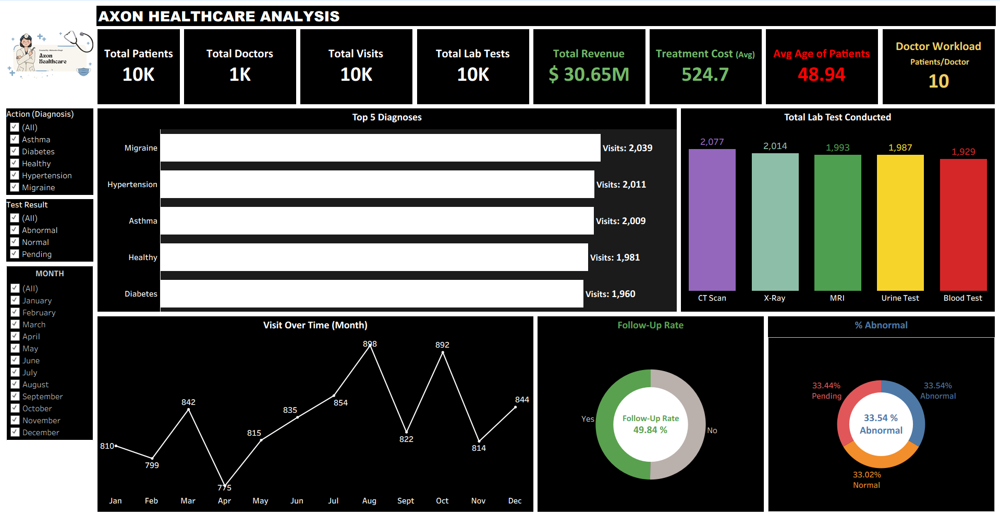

# 🏥 Healthcare Data Analytics Project 

## 🧠 Project Overview
This project was developed during my Data Analytics Learning Phase. This Project is analysis for healthcare operations data and derive key business insights.  
It integrates **Excel, Power BI, Tableau, and SQL** to build a unified analytics system for hospitals and clinics.

## 📊 Project Objective
To identify trends in patient care, doctor workload, treatment costs, and diagnostic activity using modern data analytics tools.

---

## 📁 Tools & Technologies
- **Excel** → Data cleaning, KPI calculations
- **Power BI** → Interactive business dashboards
- **Tableau** → Visual storytelling and trend exploration
- **SQL** → Querying and joining multiple data sources

---

## 📈 Key Performance Indicators (KPIs)
| KPI | Description | Value |
|-----|-------------|--------|
| Total Patients | Number of patients recorded | 10,000 |
| Total Doctors | Number of doctors | 1,000 |
| Total Lab Results | Diagnostic lab tests performed | 10,000 |
| Total Treatments | Total treatments provided | 10,000 |
| Total Visits | Recorded patient visits | 10,000 |
| Avg. Treatment Cost | Mean cost per treatment | $524.7 |
| Follow-up Rate | % of patients returning | 49.84% |
| Doctor Workload | Avg. patients per doctor | ~10 |
| % Abnormal Lab Results | Abnormal lab tests | 33.5% |
| Top Diagnoses | Migraine, Hypertension, Asthma, Diabetes | — |

---

## 📸 Dashboard Snapshots

### Excel

### Power BI

### Tableau

---

## 💡 Key Insights
- **Strong Patient Engagement:** 10K patients with consistent visits indicate stable healthcare utilization.  
- **Balanced Workforce:** 1K doctors managing workloads efficiently.  
- **Revenue Stability:** $30.65M revenue with moderate treatment cost.  
- **Health Patterns:** Migraine, Hypertension, Asthma, and Diabetes are most common.  
- **Retention Opportunity:** 49.84% follow-up rate shows room for patient loyalty programs.  

---

## ⚙️ Challenges Faced
- Data cleaning (missing values, duplicates)
- Merging data from Excel, SQL, Power BI, and Tableau
- Outlier handling and data standardization
- Tool-specific chart and KPI limitations
- Scalability with large datasets

---

## 👤 Author
**Vaishnavi Surwade** 
🎓 Data Analyst | Excel | SQL | Power BI | Tableau
---
